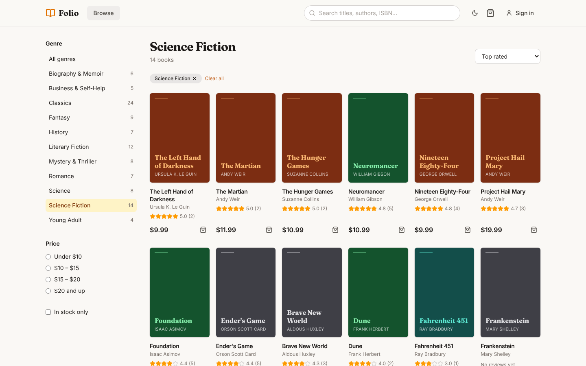
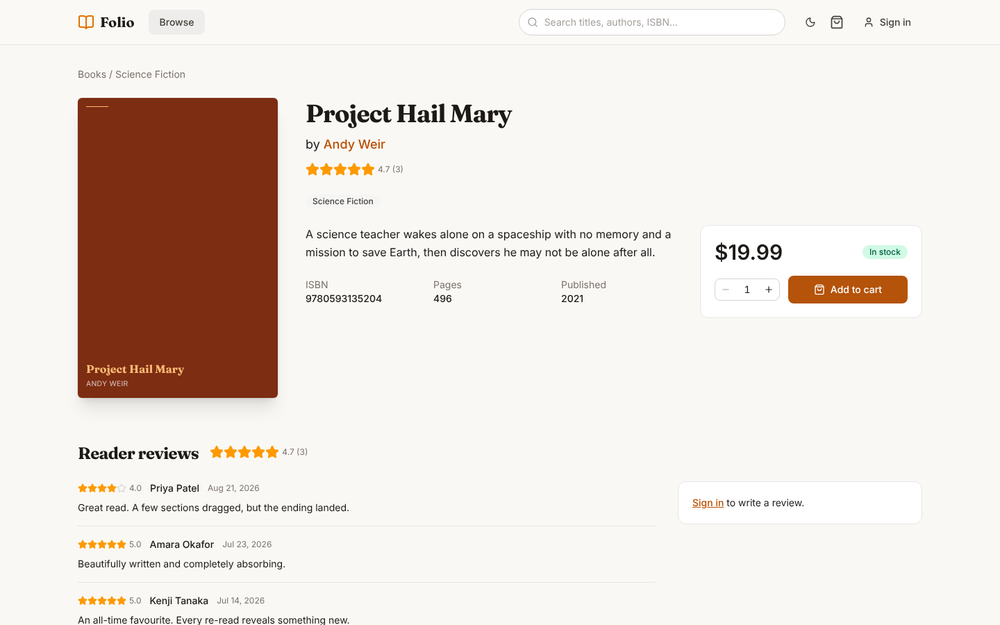
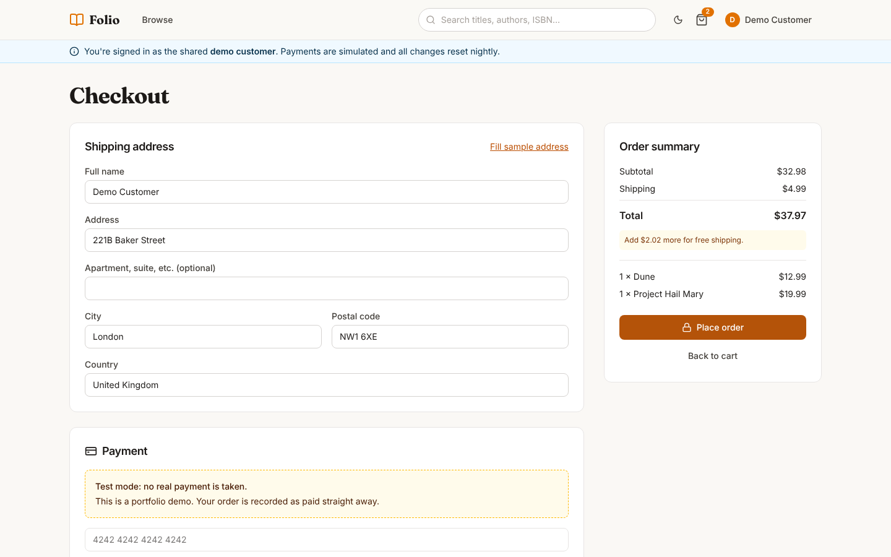
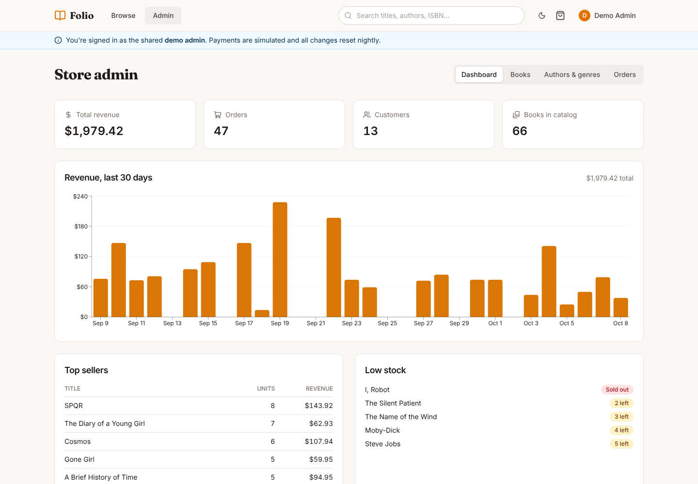
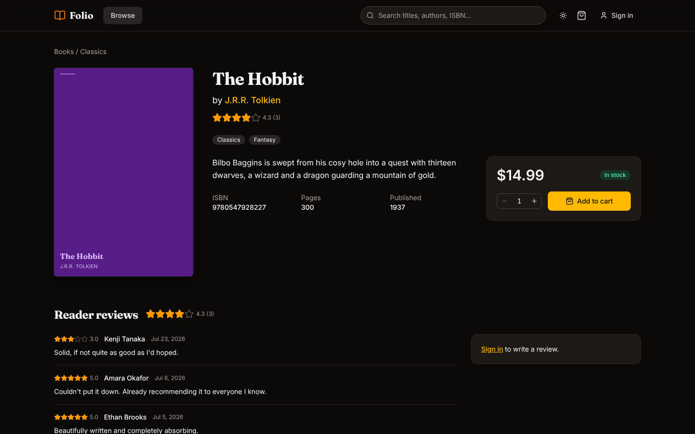
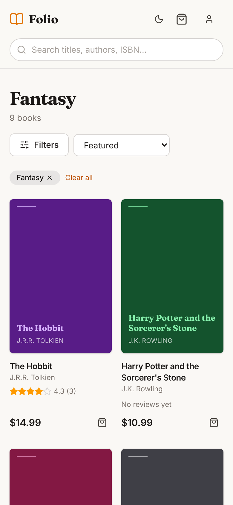

# Folio

An online bookstore I built to practice the full stack end to end: React on the front, Express and Postgres on the back, deployed on Vercel, Render and Neon.

Live: https://bookstore.rahulnainala.com (API docs at [/api/docs](https://bookstore.rahulnainala.com/api/docs))

You don't need to sign up. The sign-in page has buttons to log in as a demo customer or a demo admin. Payments are fake and the database resets every night, so feel free to break things.


## Features

- Catalog of 66 books with search (title, author, ISBN), genre and price filters, sorting and pagination. Filters live in the URL so you can share a search.
- Book pages with reviews, stock levels and related books.
- Cart that works before you log in and gets merged into your account when you do.
- Checkout and order history.
- Admin dashboard: revenue chart, top sellers, low stock, plus editing books, authors, genres and order status.
- Dark mode, and it works on phones.

| Catalog                                        | Book page                               | Checkout                                       |
| ---------------------------------------------- | --------------------------------------- | ---------------------------------------------- |
|        |       |      |
| **Admin**                                      | **Dark mode**                           | **Mobile**                                     |
|  |  |  |

## Stack

- **Web:** React 19, Vite, TypeScript, React Router, TanStack Query, Tailwind, react-hook-form, Recharts
- **API:** Express 5, TypeScript, Drizzle ORM, PostgreSQL, Zod, JWT in an httpOnly cookie
- **Tests:** Vitest + Supertest against a real Postgres, Testing Library, Playwright
- **Hosting:** Vercel (web), Render (API), Neon (database), GitHub Actions for CI and the nightly reset

It's an npm workspaces monorepo:

```
apps/api         Express API, Drizzle schema, migrations, seed data, tests
apps/web         React app
packages/shared  Zod schemas and types used by both
e2e              Playwright tests
```

## Things worth pointing out

**Checkout doesn't oversell.** Placing an order locks the book rows, checks stock, copies the prices into the order, decrements stock and clears the cart in one transaction. There's a test that has three people try to buy the last copy at the same time and checks that only one of them gets it.

**Validation is defined once.** The request schemas in `packages/shared` are used by the API to validate input, by the forms in the UI, and to generate the OpenAPI docs.

**One origin.** Vercel proxies `/api/*` to the API (Vite does the same in dev), so the session cookie is a normal first-party cookie and there's no CORS setup or token in localStorage.

**The demo is hard to wreck.** The demo admin can edit anything but can't delete the original catalog, login is rate limited, and a GitHub Action reseeds the database every night.

**Cold starts.** Render's free tier sleeps after a while, so the first request can take up to a minute. The site shows a banner while the API wakes up instead of just spinning.

## Running it locally

You need Node 22 and Postgres (the included `docker-compose.yml` works).

```bash
npm install
docker compose up -d
cp apps/api/.env.example apps/api/.env
npm run db:migrate
npm run db:seed
npm run dev        # API on :8000, web on :5173
```

Other scripts: `npm test`, `npm run e2e`, `npm run lint`, `npm run typecheck`, `npm run db:reset`.

Demo logins, if you'd rather type them: `demo@bookstore.test` / `demo-customer` and `admin@bookstore.test` / `demo-admin`.

Deployment notes are in [docs/deployment.md](docs/deployment.md).

## Credits

Covers come from the [Open Library Covers API](https://openlibrary.org/dev/docs/api/covers). When a cover is missing, the app draws a simple one instead.
