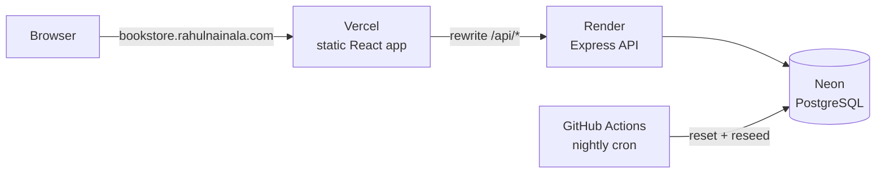

# Folio: a full-stack online bookstore

[](https://github.com/rahulnainala/bookstore/actions/workflows/ci.yml)

Folio is a working online bookstore built as a portfolio project. Visitors can search and filter a catalog of 66 real books, read and write reviews, fill a cart, and check out. Admins get a dashboard with sales charts and full catalog and order management.

**Live demo:** https://bookstore.rahulnainala.com · **API docs:** https://bookstore.rahulnainala.com/api/docs

> No sign-up needed: the sign-in page has **Try as demo customer** and **Try as demo admin** buttons.
> Payments are simulated and the demo database resets every night.


## What it does

**Shopping**

- Search by title, author or ISBN. Filter by genre, price and availability. Sort and paginate. All state lives in the URL, so results can be shared and the back button works.
- Book pages show cover, description, stock level, ratings and related books.
- A guest cart is kept in the browser and merges into the account cart when the visitor signs in.
- Checkout validates the address and places the order in a single database transaction. It shows a confirmation page and order history.
- Readers can leave reviews (one per reader per book) with star ratings.

**Admin**

- Dashboard with revenue, orders, customers, a 30-day revenue chart, top sellers and low-stock alerts.
- Create, edit and delete books (with genres and cover URL), authors and genres.
- Change order status. Cancelling an order puts its books back in stock.

**Quality**

- Responsive down to 360px, with light and dark themes, skeleton loaders, and empty and error states.
- Accessible markup: labelled controls, keyboard navigation, skip link, live regions.
- 37 API integration tests, 11 UI unit tests and 5 Playwright end-to-end journeys, all run in CI.

| Catalog                                        | Book detail                             | Checkout                                       |
| ---------------------------------------------- | --------------------------------------- | ---------------------------------------------- |
|        |       |      |
| **Admin dashboard**                            | **Dark mode**                           | **Mobile**                                     |
|  |  |  |

## Tech stack

| Layer    | Choices                                                                                               |
| -------- | ----------------------------------------------------------------------------------------------------- |
| Frontend | React 19, Vite, TypeScript, React Router 7, TanStack Query, Tailwind CSS 4, react-hook-form, Recharts |
| Backend  | Node 22, Express 5, TypeScript, Drizzle ORM, PostgreSQL 16, Zod, JWT (httpOnly cookie), pino          |
| Shared   | `@bookstore/shared`: Zod schemas and types used by both the API and the UI                            |
| Testing  | Vitest, Supertest (against a real Postgres), Testing Library, Playwright                              |
| Tooling  | npm workspaces, ESLint, Prettier, GitHub Actions                                                      |
| Hosting  | Vercel (web), Render (API), Neon (Postgres)                                                           |

## Architecture



```
apps/
  api/          Express API: routes → services → Drizzle → Postgres
    drizzle/    SQL migrations (generated by drizzle-kit, committed)
    src/db/     schema, seed data, migrate/seed/reset
    test/       integration tests against a real database
  web/          React SPA: routes, components, data hooks
packages/
  shared/       Zod schemas, types and money helpers shared by api and web
e2e/            Playwright end-to-end tests
```

## Design decisions

- **The web app and API share one origin.** Vercel rewrites `/api/*` to the API, and Vite's dev proxy does the same locally. The session cookie is therefore first-party (`HttpOnly`, `Secure`, `SameSite=Lax`), with no CORS setup and no tokens in `localStorage` for scripts to steal.
- **Schemas are written once.** Every request body and query string is a Zod schema in `packages/shared`. The API uses it to validate, the forms use it for client-side validation, and the OpenAPI document at `/api/docs` is generated from it, so docs, UI and server can't drift apart.
- **Checkout can't oversell.** Placing an order locks the affected book rows (`SELECT … FOR UPDATE`, in id order to avoid deadlocks), re-checks stock, snapshots prices into the order, decrements stock and empties the cart in one transaction. A test fires three simultaneous checkouts at the last copy and asserts that exactly one succeeds.
- **Order history is immutable.** Order lines store the title and unit price at purchase time. Later price edits or even deleting the book don't rewrite past orders.
- **The public demo is safe to share.** Demo accounts are one click away. The shared demo admin can edit anything but can't delete the starter catalog, and a nightly GitHub Action reseeds the database. Auth endpoints are rate limited.
- **Errors are predictable.** Every error has the same shape, `{ error: { code, message, details } }`. Validation errors map to individual form fields in the UI, and database constraint violations become `409`s instead of `500`s.
- **Cold starts are explained.** Render's free tier sleeps when idle. The UI pings `/api/health` and shows a "waking up the demo server" banner instead of leaving visitors staring at loading skeletons.

## API overview

Full interactive docs: `/api/docs` (Swagger UI) and `/api/openapi.json`.

| Method               | Path                                                  | Notes                                                                              |
| -------------------- | ----------------------------------------------------- | ---------------------------------------------------------------------------------- |
| `GET`                | `/api/v1/books`                                       | `q`, `genre`, `author`, `minPrice`, `maxPrice`, `inStock`, `sort`, `page`, `limit` |
| `GET`                | `/api/v1/books/:slug`                                 | Book detail and related books                                                      |
| `GET` `PUT` `DELETE` | `/api/v1/books/:id/reviews`                           | List reviews, or create, replace or delete your own                                |
| `GET`                | `/api/v1/authors`, `/authors/:id`, `/genres`          | Catalog metadata with counts                                                       |
| `POST`               | `/api/v1/auth/register`, `/login`, `/demo`, `/logout` | Cookie session                                                                     |
| `GET` `PUT` `DELETE` | `/api/v1/cart`, `/cart/items/:bookId`                 | Signed-in cart; `POST /cart/merge` for guest carts                                 |
| `POST` `GET`         | `/api/v1/orders`, `/orders/:id`                       | Checkout and order history                                                         |
| various              | `/api/v1/admin/*`                                     | Stats, books, authors, genres and orders (admin only)                              |

## Running locally

Requirements: Node 22+, and Docker or a local PostgreSQL 16.

```bash
npm install
docker compose up -d                 # Postgres on :5432 (also creates bookstore_test)
cp apps/api/.env.example apps/api/.env
npm run db:migrate && npm run db:seed
npm run dev                          # API on :8000, web on http://localhost:5173
```

| Command                                                 | What it does                                                            |
| ------------------------------------------------------- | ----------------------------------------------------------------------- |
| `npm run dev`                                           | API (watch mode) and web app together                                   |
| `npm test`                                              | API integration tests and web unit tests                                |
| `npm run e2e`                                           | Playwright tests (starts its own servers on a fresh `bookstore_e2e` DB) |
| `npm run lint` / `npm run typecheck` / `npm run format` | Static checks                                                           |
| `npm run db:reset`                                      | Re-run migrations and reseed demo data                                  |
| `npm run db:generate`                                   | Create a migration after editing `apps/api/src/db/schema.ts`            |

Demo credentials (also available as buttons): `demo@bookstore.test` / `demo-customer` and `admin@bookstore.test` / `demo-admin`.

## Deployment

See [docs/deployment.md](docs/deployment.md) for the step-by-step Neon, Render, Vercel and DNS setup.

## Credits

Book covers are loaded from the [Open Library Covers API](https://openlibrary.org/dev/docs/api/covers). When a cover is missing, a typographic cover is generated instead. Book descriptions in the seed data are original summaries written for this project.

Built by [Rahul Nainala](https://rahulnainala.com).
